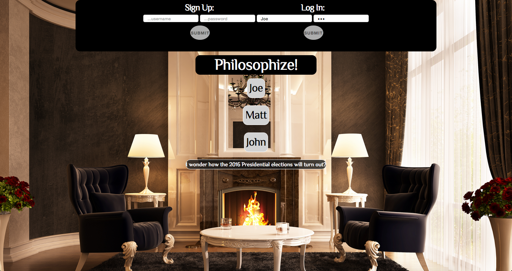
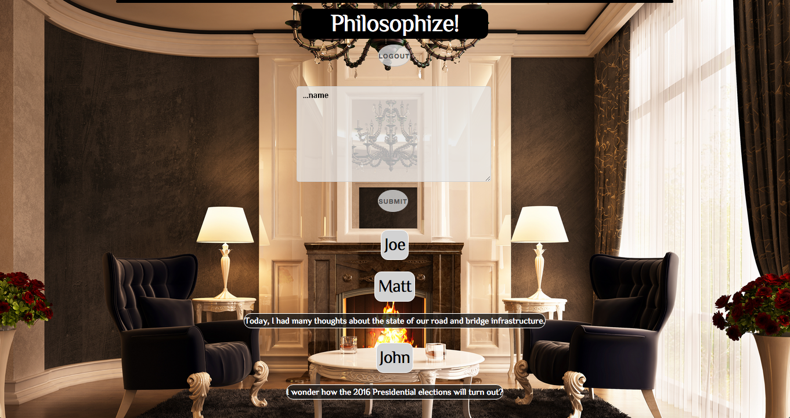

# Journal
 A MEAN stack blog where people can log their more philosophical thoughts and observations.

https://floating-ravine-2297.herokuapp.com/

## User Stories

 As a user I want to be able to
  - create an account and sign in to my profile page so only I can be the one who can add posts to my username.
  - create a narrative between users, taking part in discussion of introspective thoughts.
  - see a list of other users' blog entries.
  - log out when I am done posting new entries.

## Technologies
  - Node.js
  - MongoDB
  - Express
  - Angular.js
  - Skeleton CSS framework

## Screenshots

